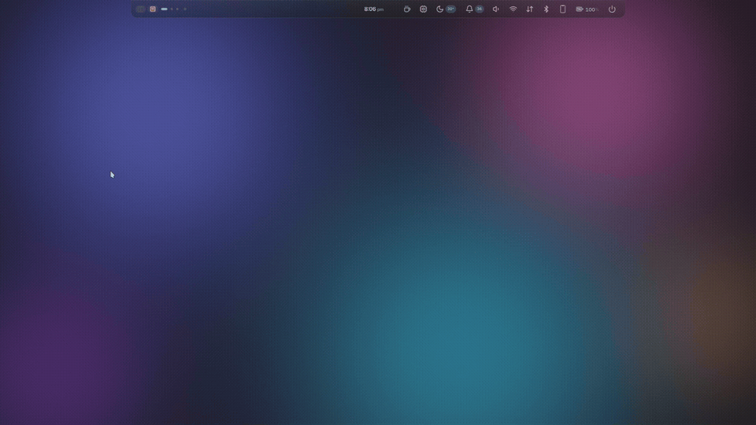
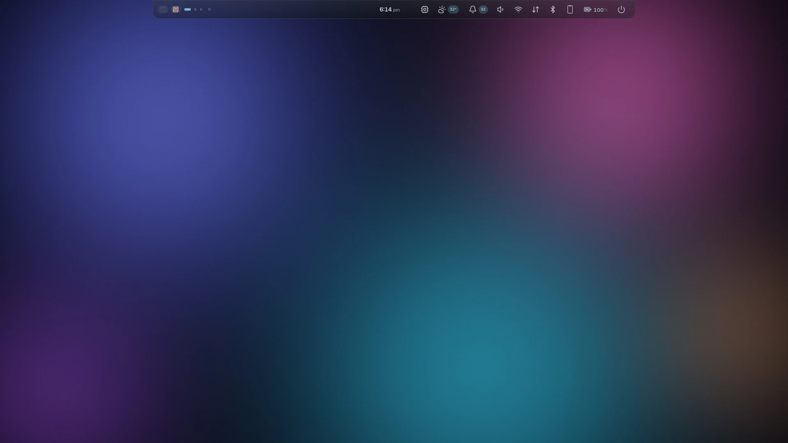
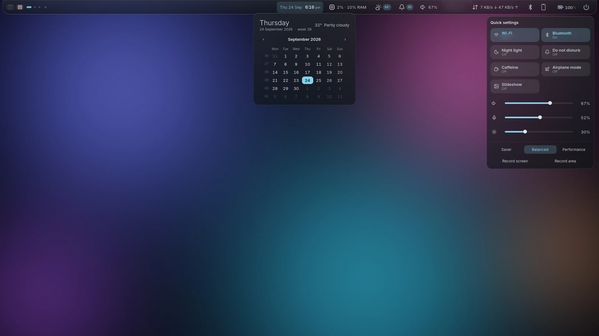
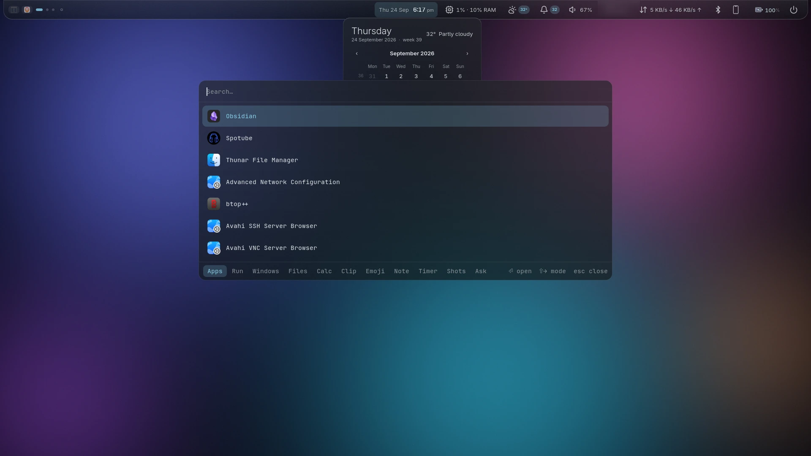
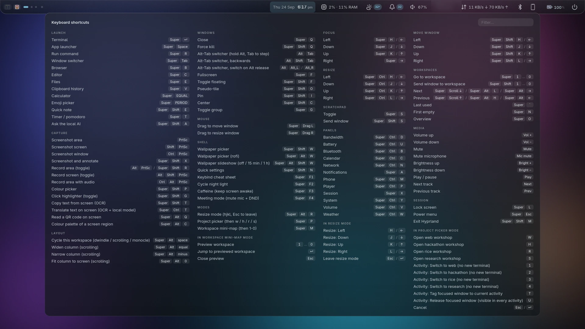
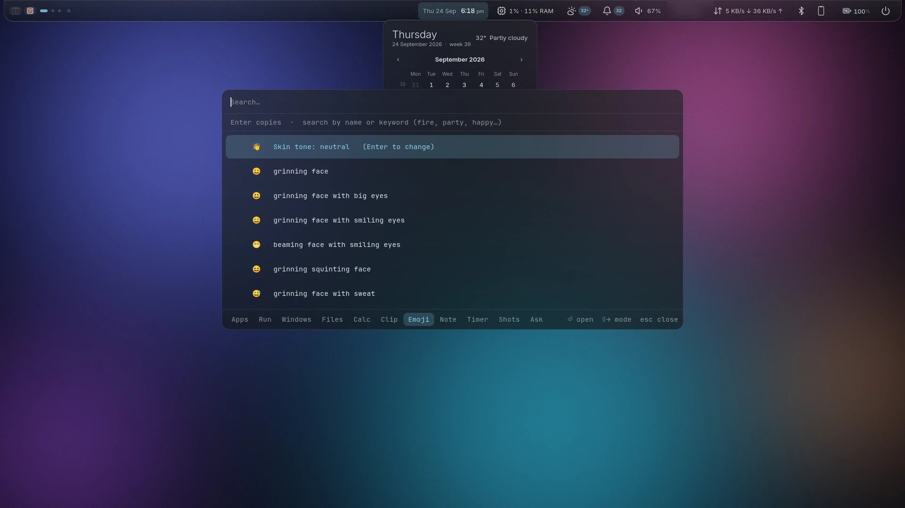

# hyprland-lua-rice — a Hyprland (Lua) desktop




*Picking a wallpaper re-themes the bar, Control Center and everything else live — matugen
generates the palette, every open surface picks it up immediately.*

A from-scratch Hyprland desktop: compositor config in **Lua** (not the old
hyprlang `.conf`), an [AGS](https://github.com/Aylur/ags) v3 / Astal shell
(bar, dropdowns, notifications, OSD, Control Center), a rofi launcher with extra
modes, and wallpaper-driven theming with matugen.

Targets **Hyprland 0.56.x on Arch Linux** (AMD iGPU laptop, 1920x1080@144).

> The compositor config is Lua (`hyprland.lua`, `conf/*.lua`). `hyprlock`,
> `hypridle`, `hyprsunset` and `rofi` are separate apps and keep their own
> formats — do not "convert" those files.

## What's in it

| path | what |
|---|---|
| `hyprland.lua`, `conf/` | compositor: env, looks, input, rules, binds, autostart |
| `ags/` | the shell (TypeScript/JSX): bar, dropdowns, popups, OSD, Control Center, cheat sheet |
| `systemd/hypr-shell.service` | runs the shell as a supervised user service (auto-restarts on crash) |
| `rofi/` | glass launcher theme + config |
| `scripts/` | launcher modes, screen recording, wallpaper, checks, test helpers |
| `matugen/` | templates that turn the wallpaper into colours for everything: compositor, shell, rofi, kitty, lock screen, workspace overview, **GTK 3/4 and Qt 5/6 apps** |
| `hyprlock.conf`, `hypridle.conf`, `hyprsunset.conf` | lock screen, idle daemon, night light |
| `patches/` | fixes for AUR packages this repo depends on, needed when upstream lags the rest of the system (see Phone below) |
| `deploy.sh` | symlinks this repo into `~/.config` (dry run by default) |

Highlights: glass surfaces throughout; Control Center (Wi-Fi, Bluetooth, Night light,
Caffeine, Airplane mode, VPN and Hotspot when usable, Do not disturb, volume/mic/brightness
and per-app volume, power profiles, screen recording); a live
**keybind cheat sheet** generated from the real binds; launcher tabs for
**Calc** (with unit conversion), **Clipboard history**, **Emoji** (with skin tones),
**Notes**, **Timer** (timers, pomodoro, stopwatch), **Ask** (a local Ollama model, streamed in the background; `!` for the bigger one) and **Shots** (screenshot/recording gallery with thumbnails); screen recording with a bar indicator; night light; a weather chip; a system monitor (CPU with per-core strip, memory, GPU, disk activity, fan, busiest processes, each with a 3-minute history graph);
a restyled lock screen (with the current weather and what is playing); multi-monitor hotplug;
phone integration (battery, ring, ping, file browse — via Valent, optional); a cursor
click highlighter for recordings.

## Screenshots

| | |
|---|---|
|  Clean desktop, default wallpaper |  Bar (expanded on hover) |
|  Control Center + calendar/weather |  App launcher (rofi, glass theme) |
|  Live keybind cheat sheet (`SUPER+F1`) |  Emoji picker, with skin tones |

## Requirements

Arch Linux with Hyprland 0.56.x. Packages are listed in `packages/` (official repos, AUR,
optional); the AUR ones are the Astal shell libraries and a few tools. Fonts:
`ttf-jetbrains-mono-nerd`, `adwaita-fonts`, `noto-fonts-emoji`; the WhiteSur icon theme is AUR.
Optional: `ollama` with at least one model (the **Ask** tab; nothing leaves the machine), `power-profiles-daemon` (power-profile switch), `tesseract tesseract-data-eng`
(`SUPER+SHIFT+T`: copy text from a screen region; `SUPER+CTRL+T` translates it with your local model), `ydotool` (interaction tests only).

## Package versions and rollback

The shell runs on `aylurs-gtk-shell-git` and about 19 `libastal*-git` packages: AUR git
snapshots that move constantly, so a routine `yay -Syu` can break the bar. Two safeguards:

- `packages.lock` records the exact versions this desktop is known to work with
  (official and AUR). After any update run `scripts/pkg-versions.sh --check`; it lists
  every package whose version changed.
- `scripts/pkg-versions.sh --backup` copies the built AUR packages of the locked versions
  to `~/.local/share/hypr-shell/pkg-backup/` (about 16 MB, with `SHA256SUMS`). The copies
  matter because yay's cache is where the only good builds otherwise live, and one
  `yay -Sc` deletes them.

If an update breaks the shell, roll back just the packages `--check` reports as CHANGED,
then restart it:

```sh
sudo pacman -U ~/.local/share/hypr-shell/pkg-backup/<package>-<locked-version>-*.pkg.tar.zst
systemctl --user restart hypr-shell
```

After a successful update that you have confirmed works, refresh the lock and the backup
(`scripts/pkg-versions.sh`, then `--backup`) and commit `packages.lock`. To stop a package
updating at all, add it to `IgnorePkg` in `/etc/pacman.conf`.

## Install / restore on a fresh machine

```sh
git clone <this repo> ~/hypr-new
cd ~/hypr-new
./install.sh            # DRY RUN: shows every package and link it would touch
./install.sh --apply    # installs packages/*.txt (pacman + yay/paru), then links ~/.config/{hypr,ags,rofi}
```

The package lists are `packages/official.txt`, `packages/aur.txt` and
`packages/optional.txt` (add `--with-optional`); `packages.lock` pins known-good versions.
`install.sh` is idempotent, never deletes anything, and deploy moves old config dirs to a
timestamped backup. Flags: `--no-packages`, `--no-deploy`. For a different monitor or GPU,
copy `conf/local.example.lua` to `conf/local.lua` (untracked) and edit it. The manual route
is `./deploy.sh` / `./deploy.sh --apply` after installing the packages yourself.

`deploy.sh` refuses to apply if `scripts/check.sh` reports errors. Then:

1. Put wallpapers in `~/.config/wallpapers/` and pick one with `SUPER+SHIFT+W`; this runs matugen and themes everything.
2. Weather (optional): `scripts/weather-city.py "<your city>"`.
3. Log in to Hyprland. Autostart links and starts `hypr-shell` and `hypridle`.

`install.sh` also appends `include colors.conf` to `~/.config/kitty/kitty.conf` for you
(idempotent — checked first, only appended if missing, and a `kitty.conf` that doesn't
exist yet gets created with just that line). Using the manual `./deploy.sh` route instead
of `install.sh`? Add it yourself: matugen writes `~/.config/kitty/colors.conf`, but kitty.conf
isn't symlinked from this repo, so nothing includes it automatically outside `install.sh`.

## Updating

`~/.config/{hypr,ags,rofi}` are symlinks INTO this repo, not copies — so unlike most
dotfiles setups, `git pull` already *is* the update. No separate upgrade script needed:

```sh
cd ~/hypr-new && git pull
hyprctl reload                     # picks up .lua changes (usually automatic on save anyway)
systemctl --user restart hypr-shell  # picks up .tsx/.scss changes — AGS does not hot-reload
```

If the pull added new lines to `packages/*.txt`, rerun `./install.sh --apply` to install
them (it skips everything already installed, so this is always safe to rerun).

The generated colour files (`conf/colors.lua`, `rofi/colors.rasi`,
`hyprlock-colors.conf`, `ags/style/_colors.scss`) are **tracked on purpose**: rofi,
hyprlock and AGS import them, and a fresh clone has no matugen output yet.

## Theming other apps

Picking a wallpaper (`SUPER+SHIFT+W`) also recolours GTK and Qt apps, which pick the
colours up the next time they start.

- **GTK 3 / 4** (Thunar, pavucontrol…): matugen writes `~/.config/gtk-{3,4}.0/gtk.css`. The
  GTK 4 copy is scoped with `window:not(.hypr-shell)`, because the AGS shell is a GTK 4 app
  too and reads the same file; every shell window must keep the `hypr-shell` class.
  The WhiteSur theme hard-codes its colours, so `@define-color` overrides do nothing
  (tested); the template instead restyles the main surfaces with explicit rules
  (`matugen/templates/colors-gtk.css`) and leaves everything else as WhiteSur.
- **Qt 5 / 6** (vlc…): matugen writes a qt5ct/qt6ct colour scheme and `scripts/qt-theme.sh`
  points `qt*ct.conf` at it (Fusion style + custom palette; it needs an absolute path, so
  this file is per-user and not tracked).

## Everyday use

`SUPER+F1` shows every keybind (generated from `hyprctl binds`, so it is always current).
A few: `SUPER+Return` terminal · `SUPER+Space` launcher · `SUPER+SHIFT+N` quick settings ·
`SUPER+L` lock · `SUPER+Escape` power menu · `SUPER+F2` night light ·
`SUPER+V` clipboard (images show thumbnails) · `SUPER+SHIFT+T` copy text from screen · `SUPER+=` calculator · `SUPER+.` emoji · `SUPER+SHIFT+E` note · `SUPER+T` timer · `SUPER+SHIFT+A` ask the local AI · `SUPER+ALT+Q` read a QR code · `SUPER+ALT+C` colour palette of a region · `SUPER+F3` caffeine · `SUPER+ALT+SHIFT+W` wallpaper slideshow · `SUPER+ALT+Space` cycle the workspace layout · `Alt+Tab` window switcher (hold Alt, Tab to step, release to switch) · `SUPER+O` workspace overview (hyprexpose; arrow keys/hjkl to move, Enter to switch, `m` to move the active window) ·
`PRINT` screenshot · `SUPER+SHIFT+R` / `ALT+PRINT` record · `SUPER+SHIFT+G` click highlighter (toggle) ·
`SUPER+CTRL+<letter>` bar panels.

```sh
systemctl --user restart hypr-shell      # after editing ags/*.tsx or *.scss
journalctl --user -u hypr-shell -f       # shell logs
systemctl --user restart hypridle        # after editing hypridle.conf (it does not reload itself)
ags request -i shell <msg>               # control the running shell
```

Never run `ags run` by hand while `hypr-shell` is active — they collide.

## World clocks

Click the bar clock for the calendar; cities added with `scripts/worldclock.py add "Tokyo"`
(`remove`, `list`, `clear`) appear under it with their time, "Tomorrow/Yesterday" and how
far ahead or behind they are. Nothing shows until you add one.

## Click highlighter

`SUPER+SHIFT+G` toggles a ring around the cursor on every click — for tutorial-quality
screen recordings (pairs with the recorder above). `scripts/click-highlight.py`
(`packages/optional.txt`: `python-evdev`) watches real input devices directly, since
Hyprland's own IPC has no click event; the position comes from `hyprctl cursorpos` at
the instant of each press, not from re-deriving cursor motion by hand. Off by default —
nothing reads your input devices unless you turn it on.

## Screen tools

Select a region and: `SUPER+SHIFT+T` copies its text (OCR, every installed tesseract language),
`SUPER+CTRL+T` translates that text with your local Ollama model and copies the translation
(`scripts/ocr.sh target Gujarati` changes the target language, default English; add more
OCR languages with e.g. `tesseract-data-hin` / `tesseract-data-guj`). For translation `ollama pull
translategemma:4b` (3.3 GB, 55 languages incl. Hindi and Gujarati) is used automatically when installed, `SUPER+ALT+Q` reads a QR code (copied, never
opened) and `SUPER+ALT+C` extracts the region's six main colours.

## Phone

`SUPER+CTRL+M` (or click the bar's phone glyph, hidden until Valent is installed) shows
battery, and lets you ring the phone, ping it, browse its files, or unpair — via
[Valent](https://valent.andyholmes.ca) (`yay -S valent-git`, `packages/optional.txt`), a
GTK4/libadwaita implementation of the KDE Connect protocol chosen over the official
`kdeconnect` package specifically to avoid pulling in KDE Frameworks 6 + Qt6 Multimedia on
an otherwise pure-GTK system. Pair from your phone: install the **KDE Connect** app (same
protocol), put it on the same Wi-Fi network, and tap this machine's hostname. Nothing shows
until a phone is paired.

`valent-git`'s current source fails `-Werror` on this system's `libei` (two event enums
newer than its switch statement handles — a real upstream gap, not a local misconfiguration).
`patches/valent-git-libei-switch-enum.patch` fixes it; if `yay -S valent-git` fails with
`enumeration value 'EI_EVENT_TEXT_KEYSYM' not handled in switch`, apply it to the cached
source and rebuild:

```sh
cd ~/.cache/yay/valent-git/src/valent
patch -p1 < ~/.config/hypr/patches/valent-git-libei-switch-enum.patch
cd ../.. && makepkg -si
```

(Or add the patch to that `PKGBUILD`'s own `source=()`/`prepare()`, which survives a fresh
`git` re-checkout — this repo's own copy under `~/.cache/yay/valent-git/` already does.)

## Layouts

Layouts are per workspace (Hyprland 0.54+, built in): workspaces 1-6 tile with **dwindle**,
7-8 use **scrolling** (windows are columns on an endless strip; good for docs and chat) and 9 is
**monocle** (one window fills the workspace). Change the table in `conf/rules.lua`.
`SUPER+ALT+Space` cycles the current workspace at runtime (a config reload restores the table);
in scrolling, `SUPER+ALT+=` / `-` resize the column and `SUPER+ALT+0` fits it to the screen.

## Battery care

The battery dropdown shows battery health (wear) and a **Limit charge to 80%** switch. The
kernel only lets root change the limit, so the switch stays greyed out with a hint until you
run, once, `sudo scripts/battery-limit-setup.sh --apply` (it installs one udev rule making just
that file writable by `wheel`; run it without `--apply` first to read it, `--remove` to undo).

## Editing the config safely

- **Add a keybind** through the `bind(keys, "Group: action", dispatcher, opts?)`
  wrapper in `conf/binds.lua`, not bare `hl.bind`, so it appears in the cheat sheet.
- **`scripts/smoke-test.sh`** is the one-command health check (compositor, binds, options,
  services, launcher modes, packages, logs, repo state). Safe to run any time: it sends no
  input and changes nothing. `--full` also runs the nested-instance config check.
- After a system update run `scripts/pkg-versions.sh --check` (see above).
- After any change run `scripts/check.sh` (Lua errors, `hyprctl configerrors`, duplicate
  and undescribed binds — all must be "none") and `scripts/audit-options.py` (every
  `hl.config` option exists and matches the live value).
- Hyprland's Lua API **silently drops** wrong fields and argument shapes, so "no error"
  proves nothing. Real cases found here: `dpms("on")` toggles (use `{ action = "on" }`),
  `window.move({ silent = true })` is not an option (use `follow = false`), mouse drag
  binds take no arguments and need `{ mouse = true }`, and window-rule `class`/`title`
  are regexes, not Lua patterns. Verify the actual effect.
- `scripts/uitest.sh` drives the pointer/keyboard through ydotool (its absolute
  coordinates are 2x, handled for you); `scripts/locktest.sh` renders hyprlock in a
  nested Hyprland so you never lock your real session while testing.
- Machine-specific: this hardware suffers an amdgpu bug on suspend/resume and on
  DPMS-off, so auto-suspend and screen-off are **deliberately disabled** in
  `hypridle.conf`.

## More

`docs/` holds the conventions worth knowing before editing: [Hyprland Lua gotchas](docs/hyprland-lua.md) and [the AGS shell](docs/shell.md).
